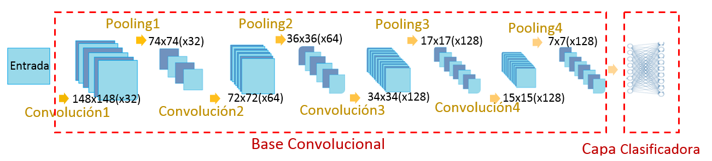
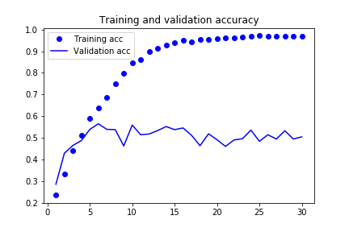
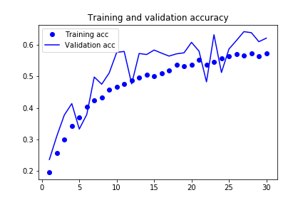

# VisualPavement

## Pavement distress detection and Classification
To maintain a road infrastructure in good condition, periodic evaluations are needed to determine its status and plan appropriate intervention actions. The road evaluation contains tests of the surface condition, which can be performed manually or automatically. The objective of this research work is to propose a methodology for the automatic classification of surface faults in flexible pavements.

## Surface distress in asphalt pavement
There is no universal system to identify surface distress, the classification of the types of distress is done in comparison with the manuals developed by different institutions. In this investigation, the classification of the deteriorations is carried out in accordance with what is established in Colombia by the National Road Institute (INVIAS). INVIAS has adopted the VIZIR methodology as a tool to assess the condition of asphalt pavement deterioration through technical standard E-813( [INVIAS](https://www.invias.gov.co/index.php/archivo-y-documentos/documentos-tecnicos/manuales-de-inspeccion-de-obras/974-manual-para-la-inspeccion-visual-de-pavimentos-flexibles/filethis), 2013), standard considers two categories of deterioration: Type A (structural) and type B (functional). Table 1 presents a list of deficiencies and their identification code.

*Table 1. INVIAS standard distress*

| Deteriorations Type A| |
|:-----|:-----|
| **Deterioration Name** | **Code** |
| Ahuellamiento	| AH |
|Depresiones o hundimientos longitudinales|	DL |
|Depresiones o hundimientos transversales|	DT |
|Fisuras longitudinales por fatiga| FLF|
|Fisuras piel de cocodrilo|	FPC|
|Bacheos y parcheos|	B|
|**Deteriorations Type B**| |
|**Deterioration Name**|	**Code** |
|Fisura longitudinal de junta de construcción|	FLJ|
|Fisura transversal de junta de construcción|	FTJ|
|Fisuras de contracción térmica|	FCT|
|Fisuras parabólicas|	FP|
|Fisura de borde|	FB|
|Ojos de pescado|	O|
|Desplazamiento, abultamiento o ahuellamiento de la mezcla|	DM|
|Pérdida de la película de ligante|	PL|
|Pérdida de agregados|	PA|
|Descascaramiento|	D|
|Pulimento de agregados|	PU|
|Exudación|	EX|
|Afloramiento de mortero|	AM|
|Afloramiento de agua|	AA|
|Desintegración de los bordes del pavimento|	DB|
|Escalonamiento entrecalzada y berma|	ECB|
|Erosión de las bermas|	EB|
|Segregación|	S|

## Training set
There are a total of 1820 pavement images, with 5947 labels distributed according to what is related in Table 2.

*Table 2: Number of labels per fault*

|Deterioration Name|	Code|	Labeled failures|
|:-----|:-----|:---|
|Ahuellamiento|	AH|	0|
|Depresiones o hundimientos longitudinales|	DL|	0|
Depresiones o hundimientos transversales|	DT|	0
Fisuras longitudinales por fatiga|	FLF|	321
Fisuras piel de cocodrilo|	FPC|	726
Bacheos y parcheos|	B|	439
Fisura longitudinal de junta de construcción|	FLJ|	736
Fisura transversal de junta de construcción|	FTJ|	152
Fisuras de contracción térmica|	FCT|	908
Fisuras parabólicas|	FP|	28
Fisura de borde|	FB|	298
Ojos de pescado|	O|	283
Desplazamiento, abultamiento o ahuellamiento de la mezcla|	DM|	0
Pérdida de la película de ligante|	PL|	473
Pérdida de agregados|	PA|	246
Descascaramiento|	D|	146
Pulimento de agregados|	PU|	378
Exudación|	EX|	213
Afloramiento de mortero|	AM|	1
Afloramiento de agua|	AA|	0
Desintegración de los bordes del pavimento|	DB|	274
Escalonamiento entrecalzada y berma|	ECB|	249
Erosión de las bermas|	EB|	73
Segregación|	S|	3
**Total Images**| 		|**5947**

For some classes we have very little or no data, therefore it was decided to implement the system for the classification of only 15 fault classes by selecting the categories that had more than 145 labels. Data were divided into 80% for training, 10% for validation and 10% for test.

## Building our network 
We use [Keras](https://keras.io/), the Python Deep Learning library. Keras workflow is as follows:
- Define training data: input tensors and target tensors.
- Define a network of layers (model) that maps its inputs to its objectives.
- Configure the learning process by selecting the loss function, the optimizer and some metrics to monitor.
- Fit the model.

### Convolutional Network 
The convolutional neural networks (convnets) are constructed with a structure that will contain 3 types of layers: convolutional layer, reduction or pooling layer and classifier layer. Table 3 summarizes the architecture of the convnet used in the classification of faults, consists of four convolutional layers (Conv2D), followed by four layers of reduction (MaxPooling2D), one layer to flatten and two dense layers at the end. Our network is illustrated in Figure 1. [see code Convnet](https://github.com/ximenarios/VisualPavement/blob/master/VisualPavConvnets.ipynb)

*Table 3. Structure of the convnet*

|Layer (type)|                  	Output Shape|
|:-----|:-----|
conv2d_1 (Conv2D)|            	(None, 148, 148, 32)            
max_pooling2d_1|	(None, 74, 74, 32)                
conv2d_2 (Conv2D)|            	(None, 72, 72, 64)            
max_pooling2d_2|	(None, 36, 36, 64)               
conv2d_3 (Conv2D)|            	(None, 34, 34, 128)           
max_pooling2d_3|	(None, 17, 17, 128)               
conv2d_4 (Conv2D)|           	(None, 15, 15, 128)          
max_pooling2d_4|	(None, 7, 7, 128)
flatten_1 (Flatten)|          	(None, 6272)                       
dense_1 (Dense)|              	(None, 512)                  
dense_2 (Dense)|              	(None, 15)                      

We have 15 classes, so we use a “softmax” layer with 15 outputs at the end, which means that it will return an array of 15 probability scores. Each score defines the probability that an image belongs to one of the 15 categories of failures.
As part of the "compilation" step we have:
- A loss function: 'categorical_crossentropy'
- An optimizer: 'rmsprop'
- Metrics to monitor during training and testing: 'acc'

*Figure 1. Convolutional neural networks*

Training an image classification model using only a few data is a common situation, we reviewed a basic strategy to address the problem by training from scratch the model of the small convolutional network defined in Table 3, and this led us to an overfitting problem illustrated in Figure 2.

*Figure 2. Training and validation accuracy*

Figure 2 shows an overfitting feature. Our training accuracy increases to a value close to 100%, while our validation accuracy ranges from 50-60%.

Because we have relatively few training samples (4664 for 15 categories), overfitting is a concern. Then data augmentation was introduced, a technique to mitigate overfitting. Data augmentation generates more training data from existing training samples, the samples are augmented through a series of random transformations that produce credible-looking images, this helps the model to expose itself to more aspects of the data and to generalize better . In keras, you can configure a transformation number to perform on the input images, using an instance of the ImageDataGenerator class. In the classification of failures, related in Table 1, the orientation is a characteristic that is taken into account to define the type of failure; For this reason, only basic transformations such as flipping, moving and zooming on the images were chosen. When training the network using the data augmentation technique, our network will never see the same input twice. However, the entries you see are still strongly correlated, since they come from a small number of original images, we cannot produce new information, we can only mix the existing information, this might not be enough to completely get rid of the overfit. Other techniques that can help mitigate overfitting are dropout and regularization L2 (weight decay). To reduce overfitting, we will also add a dropout layer to our model, just before the densely connected classifier.

Due to data augmentation and dropout, the overfitting was improved as seen in Figure 3, the training curve is better suited to the validation curve. We reach an accuracy of 60%, a relative improvement of 10% with respect to the initial model, which is not enough yet.

*Figure 3. Training and validation accuracy using data augmentation and dropout*

